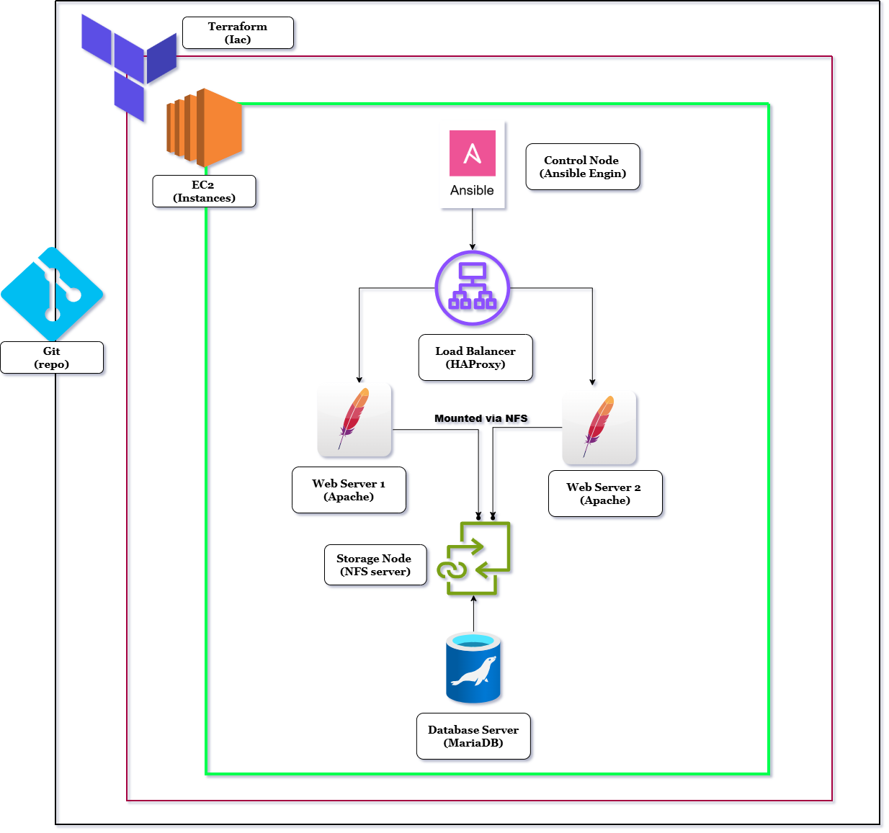
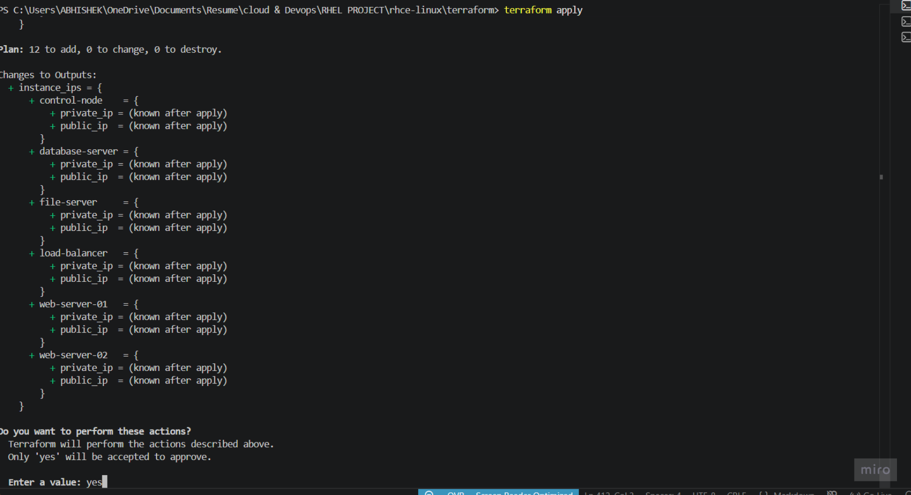
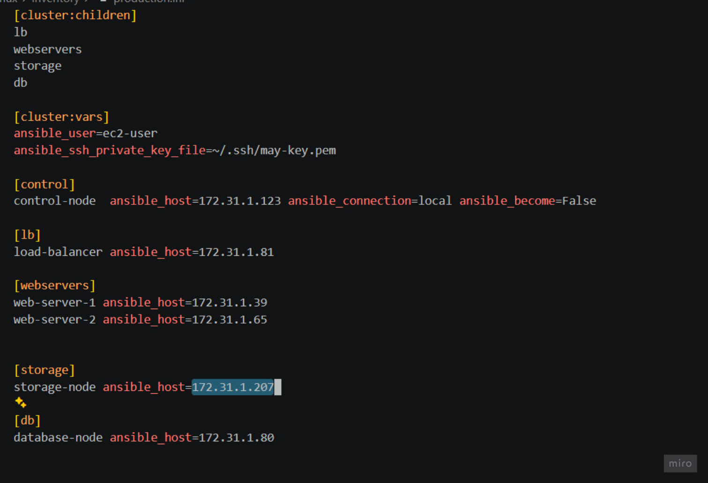
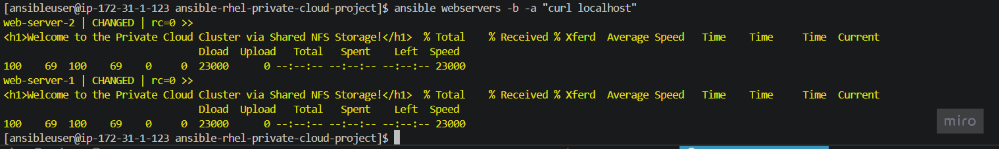
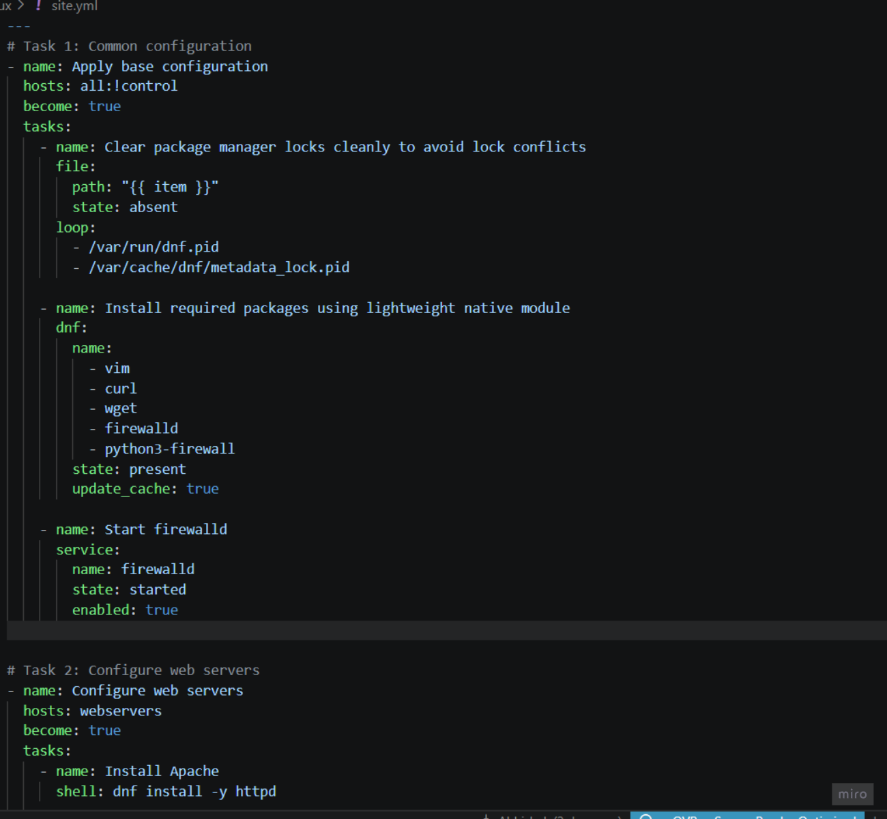
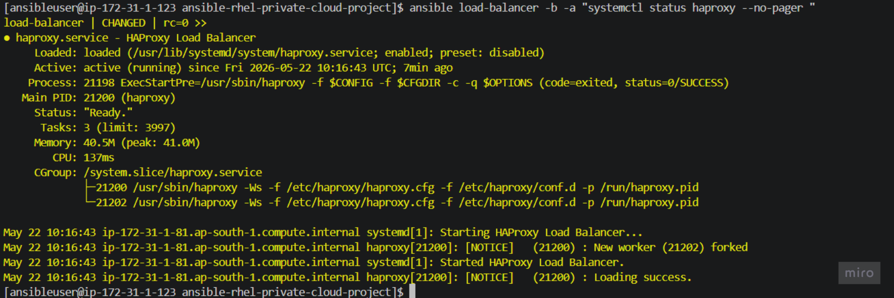
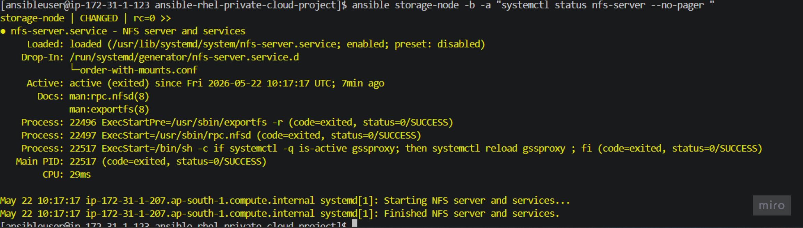

# RHCE Private Cloud Cluster Automation




**Infrastructure-as-Code** • **Configuration Management** • **High Availability** • **Shared Storage**

---

A fully automated private cloud cluster built on AWS using **Terraform** for infrastructure provisioning and **Ansible** for configuration management. The project mirrors a real-world enterprise deployment workflow: provision cloud resources, configure services across multiple nodes, centralize storage, balance application traffic, and validate the complete stack end to end.

---

## Table of Contents

1. [Project Overview](#project-overview)
2. [What Was Built](#what-was-built)
3. [Architecture Overview](#architecture-overview)
4. [Technologies Used](#technologies-used)
5. [Infrastructure Design](#infrastructure-design)
6. [Ansible Configuration](#ansible-configuration)
7. [What the Project Does](#what-the-project-does)
8. [Prerequisites Checklist](#prerequisites-checklist)
9. [Validation](#validation)
10. [Troubleshooting](#troubleshooting)
11. [Screenshots](#screenshots)
12. [Lessons Learned](#lessons-learned)
13. [Skills Demonstrated](#skills-demonstrated)
14. [Author Notes](#author-notes)

---

## Project Overview

This project demonstrates how a multi-tier Linux infrastructure can be provisioned and managed in a repeatable way. Instead of configuring each server manually, the environment is created as code and then deployed through automated playbooks.

### Final Architecture Includes

| Component | Role |
|-----------|------|
| **Control Node** | Ansible execution from a centralized orchestrator |
| **Load Balancer** | HAProxy for traffic distribution |
| **Web Servers** | Two Apache nodes serving content |
| **Storage Node** | NFS shared storage for unified web assets |
| **Database Node** | MariaDB backend service |

The workflow was built for learning, validation, and job readiness. It highlights infrastructure automation, Linux administration, service orchestration, troubleshooting, and version control discipline.

---

## What Was Built

The environment was deployed on AWS with private networking and automation through code. The stack is organized into distinct layers:

| Layer | Technology | Purpose |
|-------|-----------|---------|
| **Infrastructure** | Terraform | VPC, subnet, gateway, security groups, EC2 instances |
| **Configuration** | Ansible | Packages, services, firewall rules, storage mounts |
| **Application** | Apache | Web content delivery across two servers |
| **Traffic** | HAProxy | Round-robin load balancing |
| **Storage** | NFS | Shared content from a central node |
| **Database** | MariaDB | Backend data services |

This approach keeps the project modular, repeatable, and easy to extend.

---

## Architecture Overview

```
.
├── .gitignore
├── inventory/
│   └── production.ini
├── playbooks/
│   ├── ansible.cfg
│   └── site.yml
├── terraform/
│   └── main.tf
├── Images/
└── README.md
```

---

## Technologies Used

| Category | Tools |
|----------|-------|
| **Cloud Provider** | AWS EC2 |
| **Operating System** | Red Hat Enterprise Linux 9 |
| **Infrastructure as Code** | Terraform |
| **Configuration Management** | Ansible |
| **Web Server** | Apache HTTP Server (httpd) |
| **Load Balancer** | HAProxy |
| **Shared Storage** | NFS Utilities |
| **Database** | MariaDB |
| **Version Control** | Git / GitHub |

---

## Infrastructure Design

Terraform was used to create the base AWS environment.

### Environment Components

- Custom VPC (`172.31.0.0/16`)
- Public subnet (`172.31.1.0/24`) in `ap-south-1a`
- Internet gateway with route table
- Security groups for internal communication and service access
- 6 RHEL 9 EC2 instances (t3.micro):
  - Control node
  - Load balancer
  - Web server 1
  - Web server 2
  - Storage node
  - Database node

### Why Terraform

- Faster environment creation
- Consistent, repeatable deployments
- Fewer manual errors
- Easy cleanup and re-creation
- Version-controlled infrastructure

---

## Ansible Configuration

Ansible orchestrates the entire cluster from the control node over SSH.

### Inventory Groups

| Group | Nodes | Purpose |
|-------|-------|---------|
| `control` | 1 | Ansible orchestrator |
| `lb` | 1 | HAProxy load balancer |
| `webservers` | 2 | Apache web servers |
| `storage` | 1 | NFS export server |
| `db` | 1 | MariaDB database |

### Playbook Execution Flow

| Step | Task |
|------|------|
| 1 | Base configuration for all servers |
| 2 | Web server setup (Apache) |
| 3 | Load balancer configuration (HAProxy) |
| 4 | Storage server configuration (NFS) |
| 5 | NFS mount on web servers |
| 6 | Database server setup (MariaDB) |
| 7 | Validation and testing |

### Stability Improvements

During execution, package installation on small instances triggered memory-related failures. The issue was resolved by:

- Adding 1 GB swap space to managed nodes
- Reducing unnecessary package installs
- Installing services in a controlled manner
- Validating each node after configuration

---

## What the Project Does

### 1. Base Configuration

Each managed node receives common packages and firewall support:

- `vim`, `curl`, `wget`, `firewalld`

### 2. Web Tier

Both web servers:

- Install Apache
- Start and enable the service
- Deploy a custom web page
- Allow HTTP traffic through the firewall

### 3. Load Balancer

The load balancer:

- Installs HAProxy
- Uses round-robin backend configuration
- Forwards traffic to both web servers
- Exposes the application on port 80

### 4. Shared Storage

The storage node:

- Installs NFS utilities
- Exports `/var/nfsshare/html`
- Opens required NFS firewall ports
- Makes content available to web servers

### 5. Web Server Mounts

The web servers:

- Install NFS client utilities
- Mount the shared NFS export as `/var/www/html`
- Serve shared content for the web root
- SELinux configured with `httpd_use_nfs`

### 6. Database Node

The database node is prepared with MariaDB for backend services and private network communication.

---

## Prerequisites Checklist

### Local Setup

- [ ] VS Code installed
- [ ] Git installed
- [ ] Terraform installed
- [ ] AWS CLI configured
- [ ] SSH client available

### Verify Git Setup

```bash
git status
git remote -v
```

### Terraform Deployment

```bash
terraform init
terraform plan
terraform apply
```

### Control Node Setup

```bash
sudo dnf install -y ansible-core python3 git
ansible-galaxy collection install ansible.posix
```

### Configure Ansible

```ini
[defaults]
inventory=inventory
host_key_checking=False

[privilege_escalation]
become=True
become_method=sudo
become_user=root
```

### SSH Key Setup

```bash
chmod 600 ~/.ssh/may-key.pem
```

### Verify Connectivity

```bash
ansible all -m ping
```

### Run Project

```bash
ansible-playbook site.yml
```

### Verify Services

```bash
ansible webservers -a "systemctl status httpd"
ansible lb -a "systemctl status haproxy"
ansible storage -a "exportfs -v"
curl http://<LOAD_BALANCER_IP>
```

---

## Validation

The project was validated end-to-end using the following checks:

### Connectivity

```bash
ansible all -m ping
```

### Memory and Disk

```bash
ansible all -b -a "free -h"
ansible all -b -a "df -h"
```

### Service Checks

```bash
ansible webservers -b -a "systemctl status httpd"
ansible lb -b -a "systemctl status haproxy"
ansible storage -b -a "systemctl status nfs-server"
```

### Web Access

```bash
curl http://<load-balancer-ip>
```

### Shared Storage

```bash
ansible webservers -b -a "mount | grep nfs"
ansible webservers -b -a "cat /var/www/html/index.html"
```

---

## Troubleshooting

> This project included real troubleshooting, which became one of its strongest learning outcomes.

### Memory Pressure on Small Instances

The EC2 nodes were small (`t3.micro`) and had no swap configured initially. Package installation caused the kernel OOM killer to terminate Python-based Ansible modules, appearing as:

- `rc=137` exit codes
- SSH connections closing unexpectedly
- Module failure during `dnf` / `yum`

### Fix Implemented

- Created 1 GB swap on managed nodes
- Re-ran validation after swap was in place
- Kept playbook execution serial where needed

### Result

The automation became stable and completed successfully across the cluster.

---

## Screenshots

| Step | Screenshot |
|------|-----------|
| Terraform apply output |  |
| AWS instances |  |
| Inventory file |  |
| Ansible ping check |  |
| Ansible playbook run |  |
| Apache service status |  |
| HAProxy service status |  |
| NFS export and mount |  |
| Curl test from load balancer |  |

---

## Lessons Learned

- Automation is much easier to maintain than manual configuration
- Small cloud instances can fail under package installation load if swap is not configured
- Role-based inventory design makes Ansible projects cleaner and more maintainable
- GitHub should be used as the source of truth for project files
- Infrastructure-as-code plus configuration management is a powerful practical workflow

---

## Skills Demonstrated

| Skill | Applied In |
|-------|-----------|
| Linux Administration | RHEL 9 package & service management, SELinux, swap configuration |
| AWS Provisioning | VPC, subnet, IGW, SG, EC2 via Terraform |
| Terraform | Infrastructure as code with modules and outputs |
| Ansible | Playbooks, inventory, roles, ad-hoc commands |
| High Availability | HAProxy round-robin load balancing |
| Shared Storage | NFS exports, client mounts, firewall rules |
| Security | SELinux booleans, firewall zones, SSH key auth |
| Troubleshooting | OOM analysis, swap mitigation, log inspection |
| Version Control | Git workflow, GitHub remote management |

---

## Final Result

The final deployment provides a working private cloud cluster where:

- **Terraform** creates the infrastructure
- **Ansible** configures the servers
- **HAProxy** balances requests across web servers
- **Apache** serves the application
- **NFS** stores and shares web content centrally
- **MariaDB** is ready for backend service integration

---

## Conclusion

This project shows how a small AWS-based private cloud can be built and managed using modern automation tools. It combines infrastructure provisioning, configuration management, networking, storage, and service validation into one complete environment.

The most important outcome is not only that the project works, but that it was debugged and improved using real operational reasoning — that is the part that makes it valuable.

---

## Author Notes

<p align="center">
  <b>Maintained by <a href="https://github.com/Abhishek0609om">Abhishek</a></b>
</p>

<p align="center">
  <a href="https://github.com/Abhishek0609om">
    
  </a>
  <a href="www.linkedin.com/in/abhishek-b-aura">
    
  </a>
  <a href="mailto:stoicorion22@gmail.com">
    
  </a>
</p>

---

