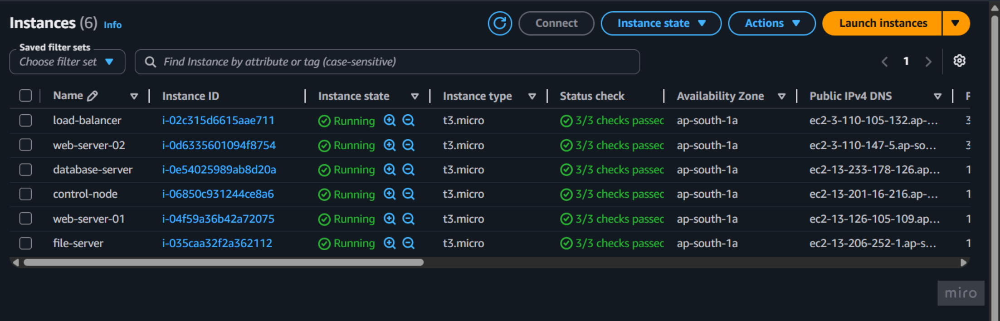
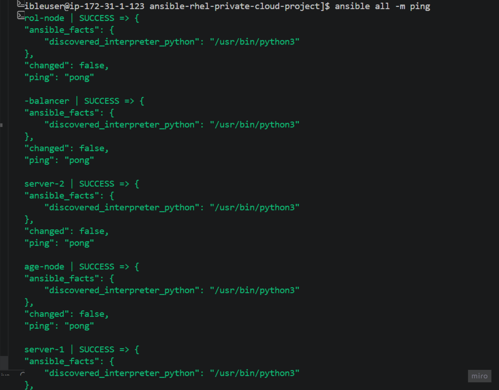
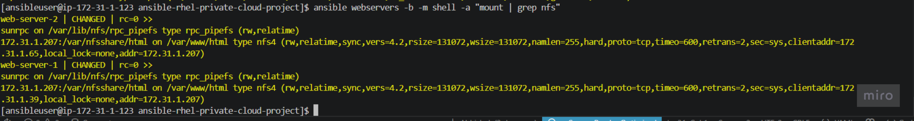
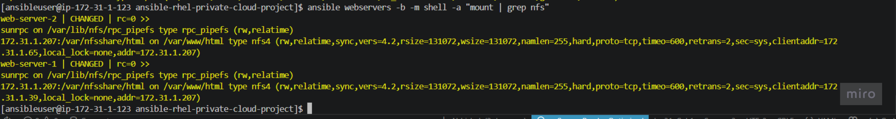
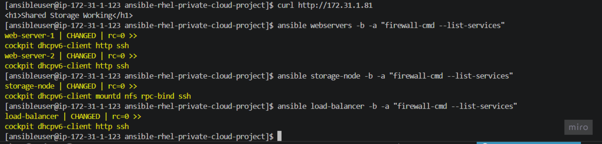

# RHCE Private Cloud Cluster Automation Project Architecture


A fully automated private cloud cluster built on AWS using **Terraform** for infrastructure provisioning and **Ansible** for configuration management. The project was designed to mirror a real-world enterprise deployment workflow: provision cloud resources, configure services across multiple nodes, centralize storage, balance application traffic, and validate the complete stack end to end.

---
## Table of Contents
1. [Project Overview](#project-overview)
2. [Architecture Overview](#architecture-overview)
3. [Prerequisites](#prerequisites-Checklist)
4. [Infrastructure Design](#infrastructure-Design)
5. [Ansible Configuration](#ansible-configuration)
6. [Playbook Execution](#playbook-execution)
7. [Validation](#validation)
8. [Troubleshooting](#troubleshooting)
9. [Screenshots](#screenshots)
10. [Author Notes](#author-notes)
  

## Project Overview

This project demonstrates how a multi-tier Linux infrastructure can be provisioned and managed in a repeatable way. Instead of configuring each server manually, the environment is created as code and then deployed through automated playbooks.

The final architecture includes:

* a **control node** for Ansible execution
* a **load balancer** using HAProxy
* **two web servers** running Apache
* a **central storage node** providing NFS shared storage
* a **database node** for backend database services

The workflow was built for learning, validation, and job readiness. It highlights infrastructure automation, Linux administration, service orchestration, troubleshooting, and version control discipline.

---

## What Was Built

The environment was deployed on AWS with private networking and automation through code. The stack was organized into distinct layers:

* **Infrastructure layer**: Terraform provisions the VPC, subnet, gateway, security groups, and EC2 instances.
* **Configuration layer**: Ansible configures packages, services, firewall rules, and storage mounts.
* **Application layer**: Apache serves web content across two web servers.
* **Traffic layer**: HAProxy distributes requests across the web tier.
* **Storage layer**: NFS provides shared content from a central storage node.
* **Database layer**: MariaDB is prepared as the backend database node.

This approach keeps the project modular, repeatable, and easy to extend.

---

## Key Highlights

* Infrastructure was created using **Terraform** instead of manual instance setup.
* Project files were version-controlled in **GitHub**.
* The control node pulled the repository and executed the automation from a clean workspace.
* **Ansible** was used for Linux package installation, service configuration, firewall control, and shared storage mounting.
* **Swap space** was added to small EC2 instances to resolve memory pressure during package installation.
* Validation was performed using `ansible`, `curl`, `systemctl`, `free`, `df`, and NFS mount checks.
* The implementation evolved into a more practical automation workflow than the initial instruction-only approach.

---

## Technologies Used

* **AWS EC2**
* **Red Hat Enterprise Linux 9**
* **Terraform**
* **Ansible**
* **Apache HTTP Server (httpd)**
* **HAProxy**
* **NFS Utilities**
* **MariaDB**
* **Git / GitHub**

---

## Architecture Overview

```text
.
├── ansible.cfg
├── inventory
├── site.yml
├── terraform/
│   ├── main.tf
│   ├── variables.tf
│   ├── outputs.tf
│   └── ...
└── README.md
```

---
## Prerequisites Checklist

### Local Setup
- VS Code installed
- Git installed
- Terraform installed
- AWS CLI configured
- SSH client available

### Verify Git Setup

```bash
git status
git remote -v
```

### Terraform Deployment
```
terraform init
terraform plan
terraform apply
```
### Control Node Setup
Install required packages:
```
sudo dnf install -y ansible-core python3 git
ansible-galaxy collection install ansible.posix
```
### Configure Ansible

ansible.cfg
```
[defaults]
inventory=inventory
host_key_checking=False

[privilege_escalation]
become=True
become_method=sudo
become_user=root
```
### SSH Key Setup
```
chmod 600 ~/.ssh/may-key.pem
```
### Verify Connectivity
```
ansible all -m ping
```
### Run Project
```
ansible-playbook site.yml
```
### Verify Services
```
ansible webservers -a "systemctl status httpd"
ansible lb -a "systemctl status haproxy"
ansible storage -a "exportfs -v"
curl http://<LOAD_BALANCER_IP>
```

## Infrastructure Design

Terraform was used to create the base AWS environment.

### Environment Components

* Custom VPC
* Public subnet for the cluster nodes
* Internet gateway
* Route table and routing rules
* Security groups for internal communication and service access
* EC2 instances for:

  * control node
  * load balancer
  * web-server-1
  * web-server-2
  * storage-node
  * database-node

### Why Terraform Was Used

* faster environment creation
* consistent deployments
* fewer manual errors
* easy cleanup and re-creation
* better version control for infrastructure

---

## Ansible Configuration

Ansible was used from the control node to manage the rest of the cluster over SSH.

### Inventory

The inventory separates nodes by role:

* `control`
* `lb`
* `webservers`
* `storage`
* `db`

This makes the automation readable and easy to maintain.

### Playbook Execution

The automation was divided into logical tasks:

1. base configuration for all servers
2. web server configuration
3. load balancer configuration
4. storage server configuration
5. NFS mount on web servers
6. database server setup
7. validation and testing

### Stability Improvements

During execution, package installation on small instances triggered memory-related failures. The issue was resolved by:

* adding swap space to the nodes
* reducing unnecessary package installs
* installing services in a controlled manner
* validating each node after configuration

---

## What the Project Does

### 1. Base Configuration

Each managed node receives common packages and firewall support.

Typical items:

* `vim`
* `curl`
* `wget`
* `firewalld`

### 2. Web Tier

The two web servers:

* install Apache
* start and enable the service
* deploy a custom web page
* allow HTTP traffic through the firewall

### 3. Load Balancer

The load balancer:

* installs HAProxy
* uses a round-robin backend configuration
* forwards traffic to both web servers
* exposes the application on port 80

### 4. Shared Storage

The storage node:

* installs NFS utilities
* exports a shared directory
* opens required NFS firewall ports
* makes the content available to web servers

### 5. Web Server Mounts

The web servers:

* install NFS client utilities
* mount the shared NFS export
* use shared content for the web root

### 6. Database Node

The database node is prepared for backend database services and private network communication.

---

## Troubleshooting

This project included real troubleshooting, which became one of its strongest learning outcomes.

### Memory Pressure on Small Instances

The EC2 nodes were small and had no swap configured initially. Package installation caused the kernel OOM killer to terminate Python-based Ansible modules, which appeared as:

* `rc=137`
* SSH connection closing unexpectedly
* module failure during `dnf` / `yum`

### Fix Implemented

* created 1 GB swap on the managed nodes
* re-ran validation after swap was in place
* kept playbook execution serial where needed

### Result

The automation became stable and completed successfully across the cluster.

---

## Validation

The project was validated using the following checks:

### Connectivity

```bash
ansible all -m ping
```

### Memory and Disk

```bash
ansible all -b -a "free -h"
ansible all -b -a "df -h"
```

### Service Checks

```bash
ansible webservers -b -a "systemctl status httpd"
ansible lb -b -a "systemctl status haproxy"
ansible storage -b -a "systemctl status nfs-server"
```

### Web Access

```bash
curl http://<load-balancer-ip>
```

### Shared Storage

```bash
ansible webservers -b -a "mount | grep nfs"
ansible webservers -b -a "cat /var/www/html/index.html"
```

---

## Lessons Learned

* Automation is much easier to maintain than manual configuration.
* Small cloud instances can fail under package installation load if swap is not configured.
* Role-based inventory design makes Ansible projects cleaner.
* GitHub should be used as the source of truth for project files.
* Infrastructure-as-code plus configuration management is a strong practical workflow.

---

## Job-Relevant Skills Demonstrated

This project demonstrates:

* Linux administration
* AWS infrastructure provisioning
* Terraform-based automation
* Ansible playbook writing
* package and service management
* firewall configuration
* NFS shared storage setup
* load balancing with HAProxy
* troubleshooting and log analysis
* Git/GitHub workflow
* production-style thinking

---

## My Approach

This project was not built as a simple copy-paste lab exercise. The implementation was adapted into a more practical workflow:

* the environment was provisioned with Terraform
* the automation code was tracked in GitHub
* the control node pulled the code for execution
* problems were diagnosed and fixed during deployment
* the final setup was validated end to end

That made the project more realistic and more useful for interviews.

---

## Screenshots

Add screenshots of:

* Terraform apply output


* AWS instances


* inventory file


* Ansible ping Check


* Ansible playbook run


* Apache service status


* HAProxy service status


* NFS export and mount output


* `curl` test from the load balancer 
!

---

## Final Result

The final deployment provides a working private cloud cluster where:

* Terraform creates the infrastructure
* Ansible configures the servers
* HAProxy balances requests
* Apache serves the application
* NFS stores and shares the web content
* the database node is ready for backend service integration

The end result is a practical Linux automation project suitable for portfolio, documentation, and job discussion.

---

## Conclusion

This project shows how a small AWS-based private cloud can be built and managed using modern automation tools. It combines infrastructure provisioning, configuration management, networking, storage, and service validation into one complete environment.

The most important outcome is not only that the project works, but that it was debugged and improved using real operational reasoning. That is the part that makes it valuable.

---

## Author Notes

This project is maintained by **[Abhishek](https://github.com/Abhishek0609om)** 🚀.  
Your feedback and contributions are welcome!

📧 **Connect with me:**
- **GitHub**: [@Abhishek0609om](https://github.com/Abhishek0609om)
- **LinkedIn**: [Abhishek](www.linkedin.com/in/abhishek-b-aura)
- **Email**: [stoicorion22@gmail.com](mailto:stoicorion22@gmail.com)

---
